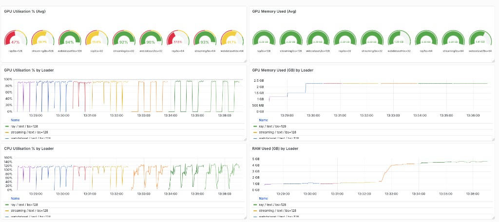

# llm-data-bench

Benchmarks three data loading pipelines for LLM/vision training workloads:
**WebDataset**, **MosaicML StreamingDataset**, and **Ray Data**.

live mdbook at : https://lucyge2022.github.io/llm-data-bench/index.html
---

## Requirements

```bash
pip install datasets huggingface_hub pyarrow webdataset mosaicml-streaming \
            ray[data] torch torchvision tqdm prometheus_client psutil
```

---

## 1. Prepare Datasets

### Text dataset : RedPajama-Data-1T

The dataset consists of 2084 jsonl files, which is too large. We can download one jsonl to begin with. Use this to check each jsonl size:
```
curl -sI https://data.together.xyz/redpajama-data-1T/v1.0.0/wikipedia/wiki.jsonl

or to get all jsonl sizes:

while IFS= read -r url; do
  size=$(curl -sI "$url" | awk -F': ' '/[Cc]ontent-[Ll]ength/{print $2}' | tr -d '\r')
  echo "$size  $url"
done < RedPajama-Data-1T-urls.txt
```
 And just do this to download the raw dataset into data/ folder:
```
wget https://data.together.xyz/redpajama-data-1T/v1.0.0/arxiv/arxiv_023827cd-7ee8-42e6-aa7b-661731f4c70f.jsonl
```

* Note that new HuggingFace Datasets version, newer versions (4.x) dropped support for dataset loading scripts. So this doesn't work:
```
from datasets import load_dataset
ds = load_dataset("togethercomputer/RedPajama-Data-1T")
```

`prepare_dataset.py` will transform downloaded jsonl dataset of [RedPajama-Data-1T](https://huggingface.co/datasets/togethercomputer/RedPajama-Data-1T)
from HuggingFace and converts it into all three loader formats (parquet,webdataset,mds).

### Run

```bash
# Get help:
python prepare_dataset.py --help

# Full download + convert all formats for a specifc modality (text or images) (recommended first run)
python prepare_dataset.py --modality text
python prepare_dataset.py --modality images [TODO]

# Only prepare specific formats
python prepare_dataset.py --formats parquet webdataset
python prepare_dataset.py --formats mds
```

### Output layout

```
data-output/
  text/
    parquet/          # e.g. 493 MB  — 1 Parquet file, used by Ray Data
    webdataset/       # e.g. 1.1 GB  — 5 .tar shards, used by WebDataset
    mds/              # e.g. 1.1 GB  — 111 .mds shards, used by StreamingDataset
  images/
    parquet/
    webdataset/
    mds/
```


### What each format looks like

**Parquet — Ray Data**
```python
import ray
ds = ray.data.read_parquet("data-output/text/parquet")
```

**WebDataset**
```python
import webdataset as wds
ds = wds.WebDataset("data-output/text/webdataset/shard-{000000..000004}.tar")
```

**MosaicML StreamingDataset**
```python
from streaming import StreamingDataset
ds = StreamingDataset(local="data-output/text/mds", shuffle=True)
```

---

## 2. Run the Benchmark

`benchmark.py` does the benchmarking by feeding dataset using different loaders with specified options (batch size) to run through a dummy training loop (GPT-2 forward pass for text modality and a small ResNet for image modality) with a specified few epochs, and track the GPU/VRAM CPU/RAM utils to visualize in a prometheus + grafana dashboard. 

Coupled with `torch.profiler` during each training epoch as an option to offer profiling capabilities during each run. This aims to compare different dataloaders with metrics in angles such as samples feeding rate, GPU utils.

```bash
# Single loader
python benchmark.py --loader ray --dataset text
python benchmark.py --loader webdataset --dataset text
python benchmark.py --loader streaming --dataset text

# Full matrix (all loaders × all datasets × batch sizes 32/64/128)
python benchmark.py --all

# Quick smoke test (20 batches, 1 epoch)
python benchmark.py --smoke-test
```

### Options

| Flag | Default | Description |
|---|---|---|
| `--loader` | — | `webdataset`, `streaming`, or `ray` |
| `--dataset` | — | `text` or `images` (images dataset is TODO) |
| `--batch-size` | `64` | Batch size |
| `--num-workers` | `4` | DataLoader worker processes (Ray: CPU budget) |
| `--epochs` | `3` | Number of epochs |
| `--max-batches` | `None` | Cap batches per epoch |
| `--output-dir` | `results/raw` | Where to save per-epoch JSON results |
| `--pushgateway` | `localhost:9091` | Prometheus Pushgateway address |
| `--profile` | off | Enable `torch.profiler` — writes Chrome trace JSON |
| `--all` | off | Run full matrix |
| `--smoke-test` | off | Quick 20-batch run |

Results are saved as JSON per epoch to `results/raw/`:
```
results/raw/<loader>_<dataset>_bs<B>_w<W>_epoch<E>.json
```

---

## 3. Profiling

```bash
python benchmark.py --loader ray --dataset text --profile
```

Trace files are written to `results/raw/profiles/<loader>_<dataset>_bs<B>/epoch<N>.json`.

Open in Chrome at `chrome://tracing` → **Load** → select the JSON file.

Each profiler run captures **5 batches** (skips 2 warmup batches) to keep file size manageable (~a few MB).

Controls in `chrome://tracing`:
- `W` / `S` — zoom in / out
- `A` / `D` — pan left / right
- Click a block → see kernel name and duration at the bottom

---

## 4. Metrics Dashboard (Grafana)

Real-time GPU util, GPU memory, CPU util, and RAM are pushed to Prometheus
during each benchmark run.

### Native install (no Docker)

```bash
sudo apt install -y prometheus prometheus-pushgateway grafana

# Add pushgateway scrape config
sudo tee -a /etc/prometheus/prometheus.yml <<'EOF'

  - job_name: pushgateway
    scrape_interval: 1s
    honor_labels: true
    static_configs:
      - targets: ["localhost:9091"]
EOF

sudo service prometheus restart
sudo service prometheus-pushgateway start
sudo service grafana-server start
```

### Access from local Mac (SSH tunnel)

```bash
ssh -N -L 3000:localhost:3000 -L 9090:localhost:9090 root@<remote-instance-ip> -p <port>
```

Then open `http://localhost:3000` (admin / admin).

### Import dashboard

1. **Connections → Data sources → Add** → Prometheus → URL: `http://localhost:9090`
2. **Dashboards → New → Import** → upload `metric-dashboard-setup/grafana-dashboard.json`

### Run with metrics push

```bash
python benchmark.py --loader ray --dataset text --pushgateway localhost:9091
```

Panels:
- GPU utilisation % over time
- GPU memory used (GB) over time
- CPU utilisation % over time
- RAM used (GB) over time

A default all panel result with text (RedPajama) dataset and GPT-2 training model, with 3 dataloaders x 3 batch sizes(32/64/128) output metrics dashboard:


