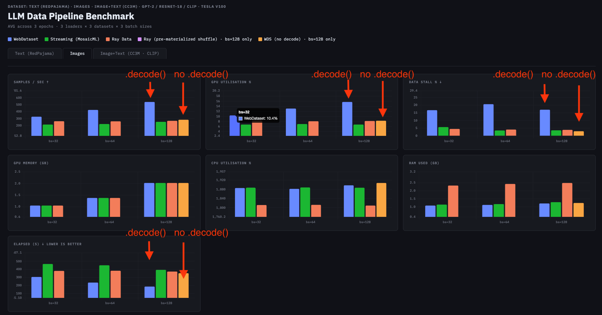

# 2. Image Dataset

---

The image benchmark uses a 64×64 image dataset. A key variable is **where JPEG decoding happens** — inside the dataloader's worker processes or in the main training process. A ResNet model is used as the training target, which requires images to be resized from 64×64 to 224×224 before ingestion.

## 2.1 WebDataset: `.decode()` vs. No `.decode()`

WebDataset exposes a `.decode()` API that runs image decoding inside worker subprocesses, leveraging Pillow's C bindings.

**With `.decode()` — worker subprocess decodes via Pillow C lib:**
```python
ds = (
    wds.WebDataset(shards, shardshuffle=True)
    .shuffle(500)
    .decode('rgb8')       # decodes to numpy uint8 [H, W, 3]
    .to_tuple('jpg')
    .batched(batch_size, partial=True)
)
```

**Without `.decode()` — raw bytes passed to main process:**
```python
ds = (
    wds.WebDataset(shards, shardshuffle=True)
    .shuffle(500)
    # .decode() omitted
    .to_tuple('jpg')      # yields raw JPEG bytes
    .batched(batch_size, partial=True)
)
# Main process then calls:
# Image.open(io.BytesIO(item)).convert('RGB')
```

**Result:** WebDataset with `.decode()` achieves roughly **2× higher sample feeding rate and GPU utilization**, and approximately **half the total training time** — even when no additional worker processes are spawned (`num_workers=0`).

WebDataset also supports fine-grained decoder dispatch for multi-modal data:

```python
dataset = wds.WebDataset(url).decode(
    wds.handle_extension("left.png",  png_decoder_16bpp),
    wds.handle_extension("right.png", png_decoder_16bpp),
    wds.imagehandler("torchrgb"),
    wds.torch_audio,
    wds.torch_video,
)
```



*Annotations show `.decode()` vs `no decode()` across samples/sec, GPU utilization, data stall %, elapsed time. The gap is consistent across all batch sizes.*

---

## 2.2 Overall Image Comparison

Ray Data and MosaicML StreamingDataset do not expose equivalent built-in decode hooks in this benchmark — raw bytes are delivered to the main process for manual decoding. When WebDataset `.decode()` is disabled, all three loaders show comparable overall performance.

**Notable observation across all loaders:** CPU utilization exceeds 1800% across batch sizes. While raw data-stall percentages appear lower than in the text benchmark, this is because JPEG decoding time is not counted as "data stall" — it is CPU-bound work in the main process that also blocks the GPU.

> **Takeaway:** Image decoding is a major bottleneck for all loaders. Offloading it to DataLoader workers (`num_workers > 0`) or using WebDataset's `.decode()` is essential for maximizing GPU utilization in image workloads.
