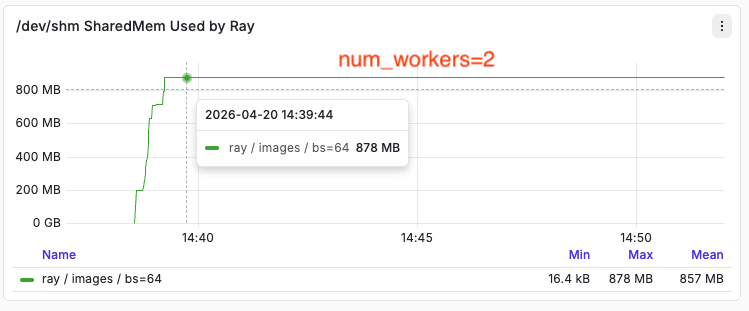

# 2. Image Dataset

---

The image benchmark uses a 64×64 image dataset. A key variable is **where JPEG decoding happens** — inside the dataloader's worker processes or in the main training process. A ResNet model is used as the training target, which requires images to be resized from 64×64 to 224×224 before ingestion.

## 2.1 Multi-worker/node image processing with WebDataset

### Spawning worker processes with `wds.WebLoader`

To run image processing in parallel,  `wds.WebLoader` spawns **worker subprocesses** :

```python
wds.WebLoader(ds, batch_size=None, num_workers=num_workers, pin_memory=False,
multiprocessing_context='spawn' if num_workers>0 else None))
# NOTE that mp_ctx = 'spawn' is necessary as without this, the usual subprocess spawn method fork() after CUDA init corrupts worker CUDA context will lead to workers hang, and hence the main process won't be getting any results from the result queue, entire program hangs.
# 'spawn' starts fresh interpreter processes, avoiding inherited CUDA state.
```

Each worker gets a forked copy of the full pipeline and independently drives the entire chain — shard reading, shuffling, decoding, resizing, and batching — before placing the completed batch into a result queue for the main process to consume:

```
Worker Process (forked copy of pipeline):
    open tar shard
        ↓
    .shuffle(500)            ← runs in worker
        ↓
    .decode('rgb8')          ← runs in worker  ✓ JPEG → numpy [H, W, 3]
        ↓
    .map(_wds_decode_sample) ← runs in worker  ✓ resize → [3, 224, 224]
        ↓
    .to_tuple("jpg")         ← runs in worker
        ↓
    .batched(64)             ← runs in worker
        ↓
    puts completed batch into result queue
                ↓
Main process:  queue.get() → train(batch)
```

> **Note:** `num_workers` must not exceed the number of shards — WebDataset assigns shards to workers round-robin, and any worker that receives no shard will raise a `ValueError`.

**Step1 `.shuffle()` — local buffer shuffle**

Explained in text dataset.

**Step2 `.decode()` — worker subprocess decodes via Pillow C lib:**

WebDataset exposes a `.decode()` API that runs image decoding inside worker subprocesses, leveraging Pillow's C bindings.
```python
ds = (
    wds.WebDataset(shards, shardshuffle=True)
    .shuffle(500)
    .decode('rgb8')       # decodes to numpy uint8 [H, W, 3]
    .to_tuple('jpg')
    .batched(batch_size, partial=True)
)
```
... if there are other processing in the pipeline for each worker, and finally the generated batch got fed into result queue for main process to consume for training.

---

## 2.2 Process images with Ray Data Operator: Transformation (map)

Ray Data exposes transformations as **operators**. Each operator call (`.map()`, `.random_shuffle()`, `.join()`, etc.) registers a step in the pipeline in the order it is called. Nothing executes until data is consumed — e.g. via `iter_batches()`.

```python
ds = ray.data.read_parquet(...)
ds = ds.random_shuffle()
ds = ds.map(decode_row)

for batch in ds.iter_batches(batch_size=64):  # ← triggers execution
    train(batch)
```

### Execution order once `iter_batches()` is called

**Step 1 — Load into object store**

```python
ray.data.read_parquet(<path>, parallelism=num_workers)
```

Ray reads Parquet row groups from disk in parallel and deserializes them into Arrow Tables stored in `/dev/shm` (the Plasma object store). The `parallelism` parameter controls how many blocks the dataset is split into — this also sets the granularity for all downstream operators.

> e.g. 100k rows with `parallelism=50` → 50 blocks × 2,000 rows/block. Each block becomes the unit of work for `.map()`.

**Step 2 — `random_shuffle()` — barrier**

`random_shuffle()` is a **barrier**: it waits for all blocks to land in the object store before redistributing rows across new blocks. After shuffle, the data remains split into the same number of blocks in `/dev/shm`, with Ray holding an ObjectRef for each.

> ⚠️ Pipeline order matters: if `.map()` runs before `random_shuffle()`, the shuffle barrier forces all *decoded* blocks (much larger) to materialise in `/dev/shm` simultaneously → object store memory explosion.

**Step 3 — `.map()` — streaming**

`.map()` is **not** a barrier. With `num_workers=2`, Ray assigns one block per worker and streams results:

```
Block 0 (2k rows) → Worker 1 decodes all 2k → output block in /dev/shm
Block 1 (2k rows) → Worker 2 decodes all 2k → output block in /dev/shm
                                                        ↓
                                          iter_batches slices Block 0:
                                          batch 0: rows 0–63    → train
                                          batch 1: rows 64–127  → train
                                          ...
                                          batch 31: rows 1984–1999 → train
                                          Block 0 fully consumed → FREED from /dev/shm
                                                        ↓
Block 2 → Worker 1 (now free)             iter_batches moves to Block 1
Block 3 → Worker 2 (now free)             ...
```

Workers prefetch the next block while the current one is being consumed, so at most **2–3 decoded blocks** live in `/dev/shm` at any time.

**Peak `/dev/shm` overhead estimate (2k rows, 224×224 RGB):**

```
3 blocks × 2,000 rows × (3 × 224 × 224 × 1 byte) = ~903 MB
```
Actual /dev/shm usage during the run (ray/images/bs=64/workers=2)


### Key takeaways

- **Pipeline order matters** — always shuffle before decode. `random_shuffle()` is a barrier that materialises everything before it; if that includes decoded images, object store memory explodes.
- **`parallelism` (block count) matters** — block size directly controls peak `/dev/shm` overhead. Fewer, larger blocks = less scheduling overhead but more memory per block in flight. More, smaller blocks = finer-grained parallelism but higher orchestration cost.

---

## 2.3 Process Images with MosaicML StreamingDataset

With mds dataset, it's quite easy to do parallel image process. We just need to add additional logic after when each worker seek to the position of the sample index and read the data from disk to process the image. Decoding(or additional processing) is simply triggered per sample inside `__getitem__` of the StreamingDataset (a **map-style** object representation), which DataLoader calls inside each worker process when `num_workers > 0`.

### How it works

```python
class _StreamingDecodeDataset:
    def __getitem__(self, idx: int) -> dict:
        sample = self._ds[idx]          # seek to sample by byte offset in .mds shard
        raw = sample["jpeg_bytes"]      # raw JPEG bytes
        sample["jpeg_bytes"] = _decode_resize_bytes(raw)  # decode + resize in worker
        return sample
```

The standard PyTorch `DataLoader` drives the parallelism:

```python
DataLoader(ds, batch_size=batch_size, num_workers=num_workers,
           pin_memory=True, drop_last=True)
```

```
Worker Process 1:                    Worker Process 2:
  __getitem__(idx_0)                   __getitem__(idx_1)
    → seek shard by byte offset          → seek shard by byte offset
    → read raw JPEG bytes                → read raw JPEG bytes
    → PIL decode + resize 224×224        → PIL decode + resize 224×224
    → return dict                        → return dict
          ↓                                    ↓
          └──────────── result queue ──────────┘
                              ↓
          Main process: collate → batch [B, 3, 224, 224] → train
```

### Key differences from WebDataset

| | WebDataset | StreamingDataset |
|---|---|---|
| Dataset style | Iterable (`__iter__`) | Map-style (`__getitem__`) |
| Shuffle | `.shuffle(buffer)` — approximate, in-pipeline | `shuffle_algo="py1s"` — epoch-level global shuffle |
| Shard access | Sequential tar scan | Random byte-offset seek per sample |
| Worker splitting | Shard-level (each worker owns shards) | Sample-level (DataLoader assigns individual indices) |

### Why sample-level access is possible

MosaicML's `.mds` format stores a per-shard offset table that maps each sample index to its exact byte position on disk. `__getitem__(idx)` can seek directly to any sample without scanning. This is what makes random sample access efficient and enables per-sample DataLoader worker assignment.