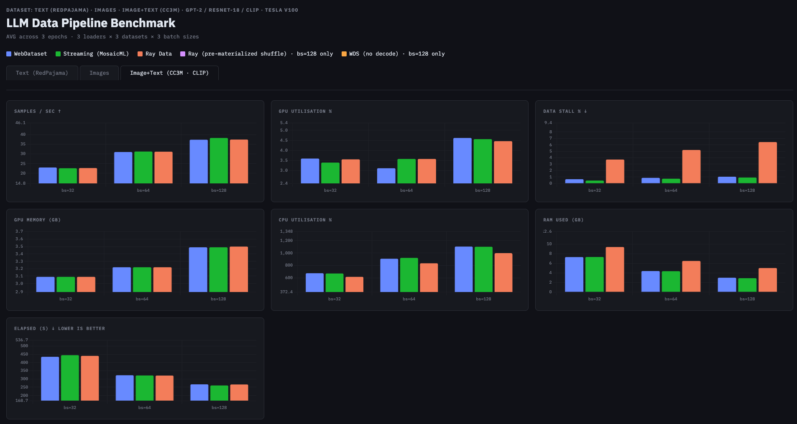

# 3. Multimodal Dataset (CC3M)

---

The multimodal benchmark uses a 10,000-sample subset of the Conceptual Captions 3M (CC3M) dataset, storing image+caption pairs in each of the three formats. CC3M contains **variable-resolution images**, which creates an important constraint: WebDataset's default `collate_fn` cannot batch tensors of different spatial dimensions.

## 3.1 Variable-Resolution Constraint

Unlike the fixed 64×64 images in the image benchmark, CC3M images span a wide range of resolutions. WebDataset's `.decode()` produces numpy arrays whose H×W varies per sample; batching these into a single tensor requires all samples in a batch to have identical shape.

**Consequence:** For the multimodal benchmark, `.decode()` is disabled for WebDataset. All three loaders deliver raw image bytes to the main training loop, which performs per-sample decoding and resizing before collation.

This levels the playing field across all three loaders: the primary performance differentiator shifts from **loader-level decode efficiency** to **sequential per-sample preprocessing throughput**.

*Image+Text (CC3M · CLIP) results. All three loaders operate on raw bytes passthrough — decode offload is disabled due to variable-resolution images. Performance differences reflect sequential preprocessing throughput.*

---

## 3.2 Format Comparison for Multimodal Storage

| Aspect | WebDataset (`.tar`) | MosaicML MDS | Ray Data (Parquet) |
|---|---|---|---|
| Access pattern | Sequential only | Random access (O(1) seek) | Sequential (Parquet rowgroup) |
| Multimodal support | Native (key-matched files in `.tar`) | Native (arbitrary fields per sample) | Requires separate image col (bytes) |
| Decode offload | Yes (`.decode()` API) | No built-in decode hook | No built-in decode hook |
| Variable-size images | Yes (bytes passthrough) | Yes (bytes passthrough) | Yes (bytes passthrough) |
| Shuffle quality | Buffer (window-limited) | Global (py1s) | Global (sort-merge) |
| Shard format | `.tar` (sequential) | `.mds` (binary, indexed) | `.parquet` (columnar) |
