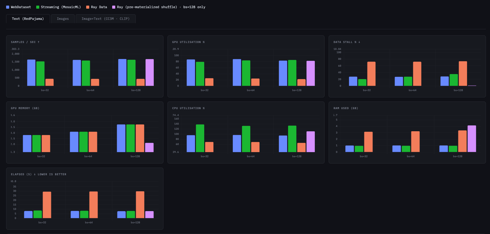
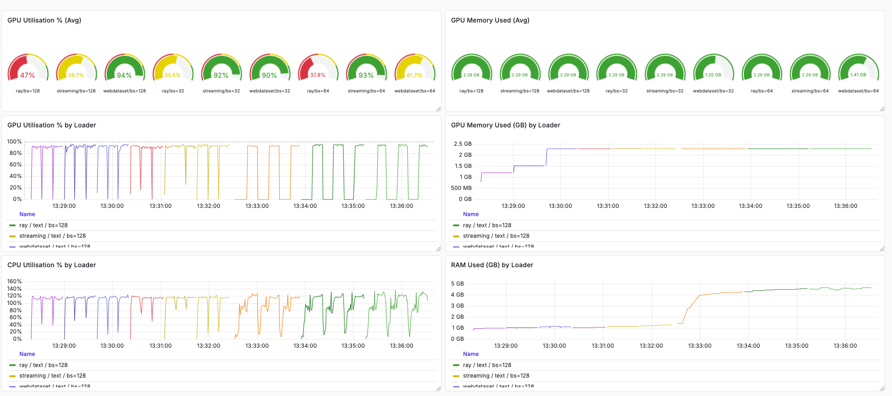

# 1. Text Dataset (RedPajama)

---

RedPajama is a large open-source pre-training corpus stored in Parquet format. For this benchmark a representative subset is loaded across three epochs, varying batch sizes to study the effects of shuffling strategy and data-loading mechanics on overall training throughput.

## 1.1 Top-level Results

Across all batch sizes, Ray Data (lazy `random_shuffle`) consistently shows:

- Longest elapsed training time
- Lowest samples/sec feeding rate
- Highest data-stall percentage
- Highest RAM usage (~3 GB vs ~1 GB for WebDataset and MDS)
- Lowest GPU utilization

The root cause is Ray's **lazy global random shuffle**, which is triggered at first batch iteration. At that point Ray spawns reader workers, writes Arrow tables to its shared Object Store, adds a random float column to each row, then performs a distributed range-based sort-merge across all partitions.



*AVG across 3 epochs · WebDataset (blue) · Streaming/MosaicML (green) · Ray Data (orange) · Ray pre-materialized (purple, bs=128 only)*

---

## 1.2 How Ray's Global Shuffle Works

```python
ds = ray.data.read_parquet("parquet_path")
  .random_shuffle()   # lazy — deferred until first iteration
  .materialize()      # forces eager execution into Object Store
```

**Step 1 — Read & tag:** Each reader worker reads assigned shards into PyArrow tables and appends a random float shuffle key to every row, writing results to the Ray Object Store.

```
Reader Worker 0:  shards 0,1  →  ObjStore partition A
Reader Worker 1:  shards 2,3  →  ObjStore partition B
```

**Step 2 — Distributed Sort-Merge:** Reducer tasks perform a range-based sort across all partitions, collecting rows by key range and merge-sorting within each range, then writing final shuffled partitions back.

```
Rows with key [0.0, 0.5)  →  Reducer 0  →  output_partition_0
Rows with key [0.5, 1.0]  →  Reducer 1  →  output_partition_1
```

> **Memory Note:** PyArrow tables are immutable. Every sort pass requires a full allocation of new memory for the sorted result. A ~700 MB raw dataset can consume ~3 GB of RAM during shuffle — roughly 4–5× raw size.

## 1.3 Effect of Pre-Materialization

To isolate the shuffle cost from batch serving, a separate run using `.materialize()` before iteration was conducted at `batch_size=128`. With pre-materialization:

- Ray's sample feeding rate and total training time drop to match WebDataset and MDS levels
- GPU utilization recovers
- Data-stall percentage falls sharply

This confirms the bottleneck is the **lazy shuffle**, not Ray's serving pipeline itself.



*Grafana dashboard: GPU utilization gauges (top), time-series GPU utilization, GPU memory, CPU utilization, and RAM used per loader across the full training run.*

## 1.4 Recommended Ray Usage Pattern

For production training loops with Ray Data, load once into the Object Store and shuffle per-epoch:

```python
ds = ray.data.read_parquet(path).materialize()  # load once, cache in Object Store

for epoch in range(num_epochs):
    # Lightweight: reorders block references only (no data copy)
    epoch_ds = ds.randomize_block_order()

    # Alternatively, for stronger shuffle:
    # epoch_ds = ds.random_shuffle().materialize()

    for batch in epoch_ds.iter_batches(batch_size=128):
        ...  # training step
```

## 1.5 Shuffling Comparison

| Attribute | WebDataset `.shuffle(1000)` | MosaicML MDS `py1s` | Ray Data `random_shuffle` |
|---|---|---|---|
| What is shuffled? | Sample bytes in sliding buffer | Global index array (integers) | Sample bytes in Object Store |
| Shuffle scope | Window of 1000 samples | Global (true 1/N) | Global (true 1/N) |
| Memory for shuffle | ~50 MB buffer | ~200 KB index only | 1 GB+ Object Store |
| First-batch latency | Same as subsequent | Same as subsequent | Much higher (sort-merge delay) |
| Random I/O required? | No (sequential `.tar` reads) | Yes (`.mds` seek by index) | No (sequential after materialise) |
| Shuffle quality | Poor (local window) | Excellent | Excellent |
| Best storage type | HDD / S3 / spinning disk | NVMe / SSD | Any (sequential read after mat.) |
| Multi-node scaling | Shard-level only | Node-local global | True distributed global |
